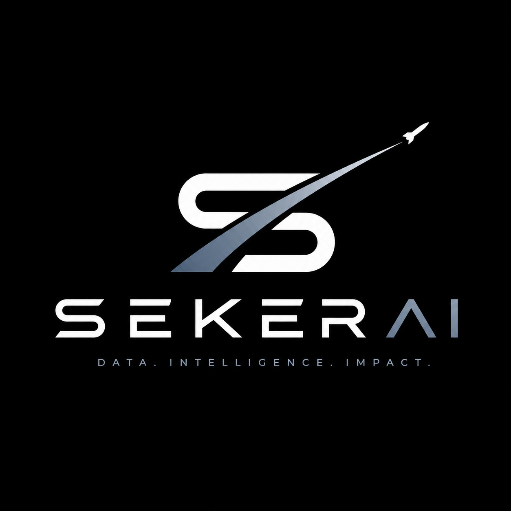
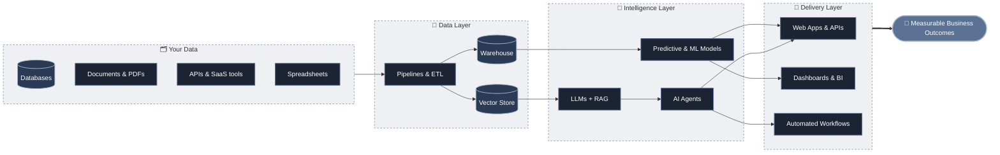

<!-- =====================================================================
     seKer AI — GitHub Organization Profile README
     Repo:   github.com/seKer-AGI/.github   →   profile/README.md
     Assets: profile/assets/*.svg — custom animated SVGs, loaded from:
             https://raw.githubusercontent.com/seKer-AGI/.github/main/profile/assets/
             (if your default branch isn't `main`, find & replace `/main/`)
     Brand:  #000000 black · #FFFFFF white · #5B7194 steel · #A7B6CC light steel
     ===================================================================== -->

<!-- ============================== HERO ================================ -->

<!-- Typing subtitle — edit `lines=` to change the rotating services -->

  

  
  
  
  
  
  

<!-- ============================== ABOUT =============================== -->
##  About seKer AI

<table>
  <tr>
    <td width="62%" valign="middle">

We're an **AI, ML & Automation agency** that builds things businesses actually use.

Most companies don't need another AI demo. They need a model that forecasts demand accurately, an agent that clears the support queue, a pipeline that turns scattered data into decisions, or a workflow that gives their team hours back every week. **That's the work we do.**

We design, build, and deploy practical **AI, Data Science, Software, and Intelligent Automation** solutions, from the first data audit to production systems that keep running after launch.

📍 Based in **Pakistan 🇵🇰**, working remotely with clients worldwide, and growing internationally.

> **Our approach:** start with the business problem, prove value early, then scale what works.

</td>
    <td width="38%" align="center" valign="middle">
      
    </td>
  </tr>
</table>

<!-- ============================== STATS =============================== -->
##  By the Numbers

<!-- ============================ SERVICES ============================== -->
##  What We Build

<b>📋 View the full service list</b>

 

| 🧠 AI & Machine Learning | ✨ Generative AI & LLMs | 📊 Data Science & Analytics |
|:--|:--|:--|
| Custom ML Models | LLM Application Development | Data Science |
| Deep Learning | RAG Systems | Data Analytics |
| Computer Vision | AI Agents & Agentic AI | Predictive Analytics |
| Natural Language Processing | AI Product Development | Business Intelligence (BI) |
| Custom AI Systems | Chatbots & AI Assistants | Dashboards & Reporting |

| ⚙️ Automation | 💻 Software Development | 🤝 End-to-End Delivery |
|:--|:--|:--|
| AI Automation | Custom Software | Discovery & AI Strategy |
| Intelligent Workflow Automation | Web Development | Prototyping & PoCs |
| Process Integration | API Development | Deployment & MLOps |
| Document & Data Processing | AI-powered SaaS Products | Ongoing Support |

<!-- ========================= SOLUTION ARCHITECTURE ==================== -->
##  Anatomy of a seKer AI Solution

<!-- ============================= PROCESS ============================== -->
##  How We Work

<!-- ============================ TECH STACK ============================ -->
<!-- Icon rows use skillicons.dev (edit the `i=` list). Tools without a
     skillicon use shields.io badges. Trim to what you actually use. -->
##  Tech Stack

<table>
  <tr>
    <td width="200"><b>🐍 Languages &amp; Data</b></td>
    <td></td>
  </tr>
  <tr>
    <td><b>🧠 ML &amp; Deep Learning</b></td>
    <td>
       
      
      
      
      
      
    </td>
  </tr>
  <tr>
    <td><b>✨ GenAI &amp; LLMs</b></td>
    <td>
      
      
      
      
      
      
    </td>
  </tr>
  <tr>
    <td><b>📊 BI &amp; Analytics</b></td>
    <td>
      
      
    </td>
  </tr>
  <tr>
    <td><b>⚙️ Automation</b></td>
    <td>
      
      
      
      
    </td>
  </tr>
  <tr>
    <td><b>💻 Backend &amp; Frontend</b></td>
    <td></td>
  </tr>
  <tr>
    <td><b>☁️ Cloud &amp; DevOps</b></td>
    <td></td>
  </tr>
</table>

<!-- ========================== WHY WORK WITH US ======================== -->
##  Why Work With Us

<table>
  <tr>
    <td valign="top" width="50%">
      
      <h4>Efficiency you can feel</h4>
      We automate the repetitive work that slows your team down, so people spend their time on decisions instead of data entry.
    </td>
    <td valign="top" width="50%">
      
      <h4>Built to scale</h4>
      Our systems are designed for production from day one, with clean APIs, solid infrastructure, and monitoring, so they grow as your business does.
    </td>
  </tr>
  <tr>
    <td valign="top" width="50%">
      
      <h4>Measurable ROI</h4>
      Every engagement starts with clear success metrics. We tie each model and workflow to a number you care about: time saved, cost reduced, or revenue gained.
    </td>
    <td valign="top" width="50%">
      
      <h4>Practical AI adoption</h4>
      No hype, no black boxes. We choose the simplest solution that works, explain the trade-offs plainly, and make sure your team can own it after handover.
    </td>
  </tr>
</table>

<!-- ============================ CALL TO ACTION ======================== -->

  
  
  
  
  
  

<b>seKer AI</b> · Pakistan 🇵🇰 → Worldwide 🌍

